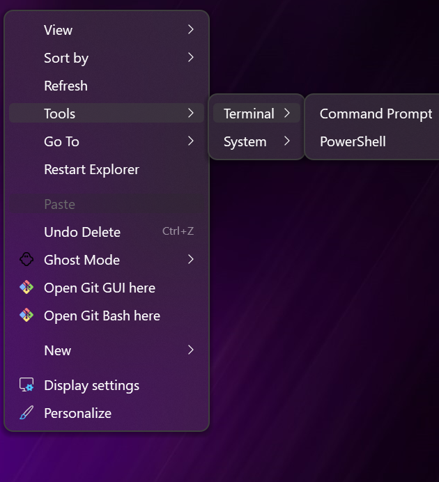
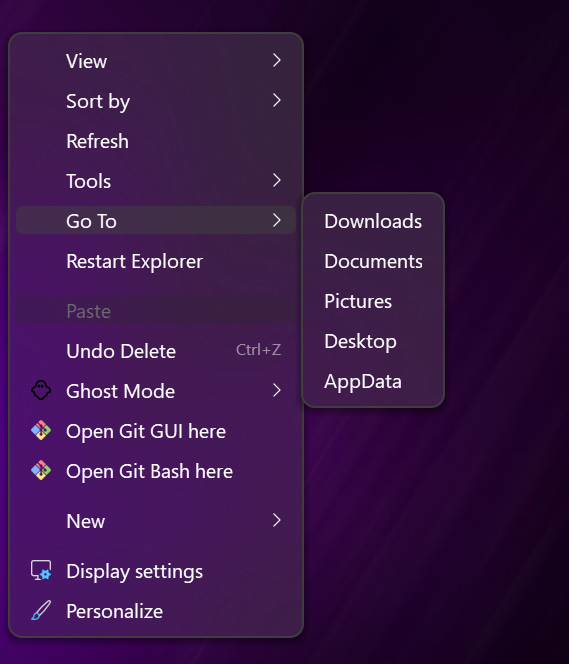

# Nilesoft Shell Config

Custom right-click context menu for Windows 11/10.

 

Adds **Tools**, **Go To**, and **Restart Explorer** to your right-click menu — works on desktop and taskbar.

## Features

| Menu | Items |
|------|-------|
| **Tools > Terminal** | Command Prompt, PowerShell |
| **Tools > System** | Task Manager, Control Panel, Settings, Run |
| **Go To** | Downloads, Documents, Pictures, Desktop, AppData |
| | Restart Explorer |

## Installation

### Via winget

```powershell
winget install nilesoft.shell
```

Copy `shell.nss` to `C:\Program Files\Nilesoft Shell\`, then run as admin:

```powershell
regsvr32 /s "C:\Program Files\Nilesoft Shell\shell.dll"
taskkill /f /im explorer.exe && start explorer.exe
```

### Via install.bat (recommended)

1. Download [install.bat](install.bat) and [shell.nss](shell.nss)
2. Right-click `install.bat` → **Run as administrator**

### Manual

1. Download [Nilesoft Shell](https://nilesoft.org/download)
2. Copy `shell.nss` to `C:\Program Files\Nilesoft Shell\`
3. Register: `regsvr32 /s "C:\Program Files\Nilesoft Shell\shell.dll"`
4. Restart Explorer

## Reload config

Hold **Ctrl** + right-click on desktop, or restart Explorer:

```cmd
taskkill /f /im explorer.exe && start explorer.exe
```